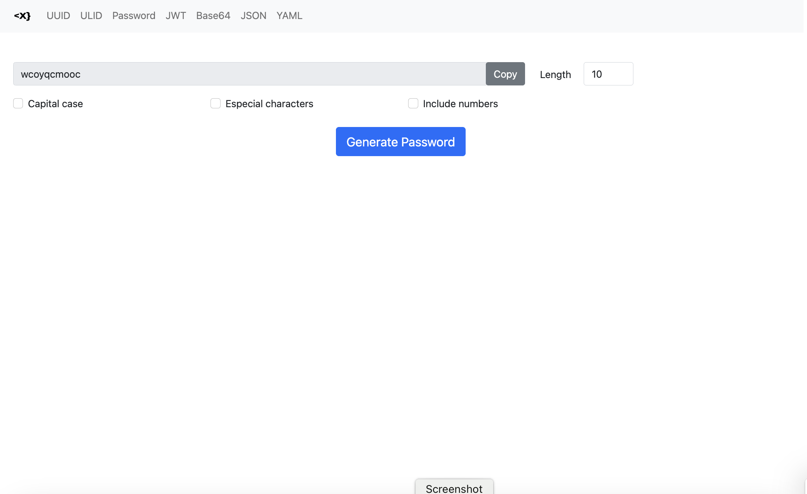

<p align="center">
  
</p>

# X development tools

[](https://codecov.io/gh/ahelmy/xdev)
  

## Inspired by [DevToys](https://github.com/veler/DevToys)

XDev helps with daily development tasks like formatting JSON, base64 encoding / decoding and others. No need to use many untrustworthy websites to do simple tasks with your data.

  

## Table of Contents

  

- [Installation](#installation)

- [Development](#development)

- [Usage](#usage)

- [Features](#features)

- [Contributing](#contributing)

- [License](#license)

  

## Installation

  

1. Clone the repository:

```shell

git clone https://github.com/ahelmy/xdev.git

```

  

2. Navigate to the project directory:

```shell

cd xdev

```

  

3. Build from source:

```shell

go build -o xdev

```

  

4. Start the application:

```shell

./xdev

```

## Development

Requirements:
- go >= 1.20

## Usage

  

You can use it directly by:

  

```shell

go  install  github.com/ahelmy/xdev@latest

```

if `go/bin` is not in your path, either add it or use `~/go/bin`

```shell
xdev -h
```

```shell
Developer Swiss Army Knife tools X for anything.

Usage:
  xdev [command]

Available Commands:
  base64decoder Decode base64 string. Alias: b64d
  base64encoder Encode string to base64. Alias: b64e
  completion    Generate the autocompletion script for the specified shell
  help          Help about any command
  json          JSON indentation and minification
  json2yaml     Convert JSON to YAML. Alias: j2y
  jwt           Decode or encode a JWT string.
  password      Password generator. Alias: pwd
  uuid          Generate a uuid string
  ulid          Generate a ulid string
  yaml2json     Convert YAML to JSON. Alias: y2j
  server        Start webserver default port 8000. Alias: s

Flags:
  -h, --help   help for xdev

Use "xdev [command] --help" for more information about a command.
```

### Web UI



## Features

  

List of features:

- [X] UUID Generator

- [X] ULID Generator

- [X] JWT decoding

- [X] Base64 encoding

- [X] Base64 decoding

- [X] JSON indention

- [X] JSON minifying

- [X] Password generator  

- [X] JSON to Yaml

- [X] Yaml to JSON

- [X] URL encoding

- [X] URL decoding 

**Next**

- [ ] JWT encoding

- [ ] Yaml2Properties

- [ ] Add hashing (SHA256, MD5, ...)

- [ ] Add `choco`, `brew` and `linux` package managers download.

...

  

## Contributing


If you are interested to fix an issue or to add new feature, you can just open a pull request.

### Contributors
<a href = "https://github.com/ahelmy/xdev/graphs/contributors">
  
</a>


## License

  

Licensed with Apache 2.0
